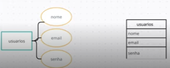

# Introdução a banco de dados relacionais (SQL)
## MER e DER (Modelo de entidade e relacionamento | Diagrama de entidade e relacionamento )

### MER 

É representado através de diagramas chamados DER

### [QuickDatabaseDiagrams](https://app.quickdatabasediagrams.com/#/)

Site utilizado para criar os diagramas

### Entidade

Representação das tabelas nomeada com substantivos concretos ou abstratas que representem claramente sua função no domínio, representadas como retângulo

### Atributos

Características das entidades, descrevem informações específicas das mesmas, representados por retângulos e as características

### Relacionamentos

Representam associações entre as entidades - (como cada tabela se relaciona com a outra), representadas por losangos

### Cardinalidade

 Relacionamento 1 para 1 (um para um) 

 Relacionamento 1..n ou 1..* (um para muitos)

 Relacionamento n..n ou *..* (muitos para muitos)

 

